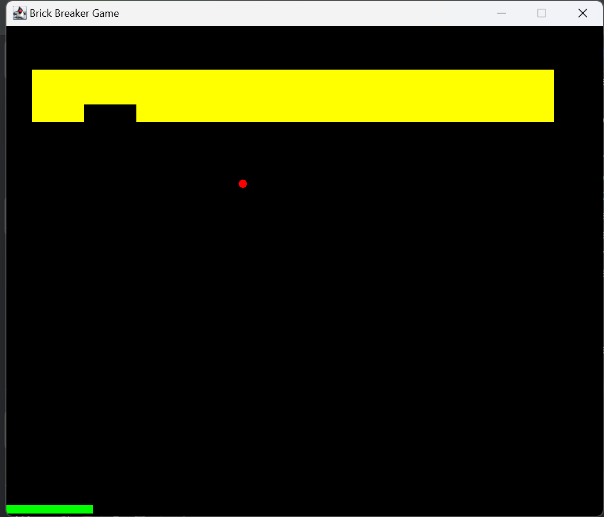

# Brick Breaker Game

A simple Brick Breaker game implemented in Java. The game features a paddle that the player controls to bounce a ball and break bricks. The goal is to break all the bricks without letting the ball fall below the paddle.

## Features

- Move the paddle left and right to bounce the ball.
- Break bricks to score points.
- The game ends when the ball falls below the paddle.

## Screenshots



## Installation

1. Clone the repository:

```bash
git clone https://github.com/yourusername/brick-breaker.git
